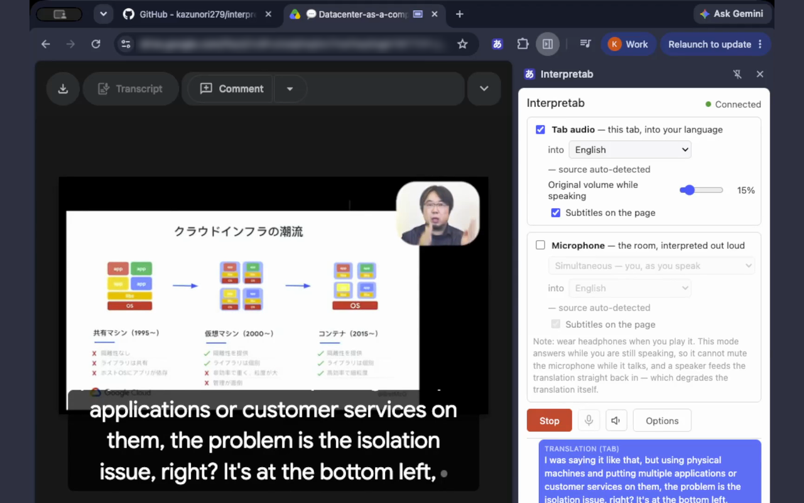
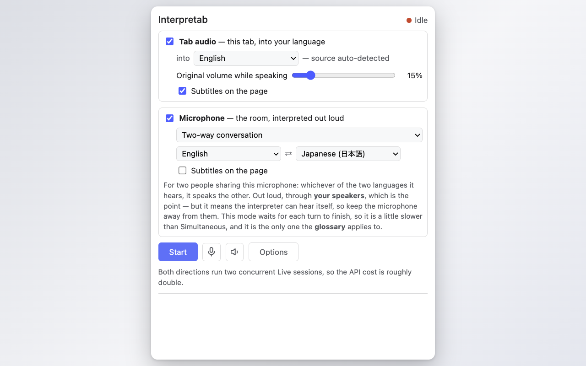

<h1 style="display:flex;align-items:center;gap:.7rem;margin:0 0 .4rem">
  
  <span>Interpretab</span>
</h1>

**Une extension Chrome qui traduit ce que votre navigateur joue, et ce que vous dites, dans plus de
70 langues en temps réel — à voix haute et sous-titré sur la page.**

## À quoi ça sert

<div style="margin:1rem 0 1.5rem">
  <p style="margin:0 0 .6rem"><b>Traduire l'audio du navigateur</b></p>
  <div style="display:flex;flex-wrap:wrap;gap:1rem 1.5rem;margin:0 0 1.25rem">
    <div style="flex:1 1 19rem;display:flex;gap:.9rem;align-items:center">
      
      <span>Regarder une vidéo, un direct ou un podcast qui joue dans votre navigateur dans la
      langue de votre choix.</span>
    </div>
    <div style="flex:1 1 19rem;display:flex;gap:.9rem;align-items:center">
      
      <span>Suivre une réunion en ligne avec tout ce que dit l'autre partie traduit dans votre
      langue.</span>
    </div>
  </div>
  <p style="margin:0 0 .6rem"><b>Traduire l'audio du microphone</b></p>
  <div style="display:flex;flex-wrap:wrap;gap:1rem 1.5rem">
    <div style="flex:1 1 19rem;display:flex;gap:.9rem;align-items:center">
      
      <span>Faire une présentation ou un direct avec votre propre voix sous-titrée à l'écran dans
      une autre langue.</span>
    </div>
    <div style="flex:1 1 19rem;display:flex;gap:.9rem;align-items:center">
      
      <span>Se réunir dans une salle, ou discuter entre amis, chacun interprété dans la langue que
      vous choisissez.</span>
    </div>
  </div>
</div>

[](../assets/hero-tab-ja-en.png)

<p><a href="https://www.youtube.com/watch?v=jiY8WJgeKCA">▶ Le voir tourner (2:45)</a></p>

## Comment fonctionne Interpretab, et la confidentialité

Interpretab traduit via la
[Gemini Live API](https://ai.google.dev/gemini-api/docs/live) de Google. Votre audio, vos
sous-titres et votre clé circulent chiffrés entre votre navigateur et Google, et n'atteignent nulle
part ailleurs. Il n'y a pas non plus de serveur d'analytique ni de collecte de données. À noter
que, s'agissant d'un modèle de la Gemini Live API, il peut traduire de façon inexacte, et produire
de la parole qui n'est pas du tout une traduction.

- [Politique de confidentialité](../PRIVACY.html) (en anglais)

## Gratuit à l'essai, environ 2 $ de l'heure à l'usage

Interpretab est un outil open source. Ce qui coûte de l'argent, c'est la Gemini Live API derrière la
traduction, et son offre gratuite suffit pour l'essayer — au-delà, **l'usage de la Gemini Live API
est facturé sur votre propre compte Google**.

Voici les tarifs de la Gemini Live API que
[Google publie](https://ai.google.dev/gemini-api/docs/pricing) en août 2026 :

| Ce qui tourne | Audio entrant | Audio sortant | **Par heure** |
|---|---|---|---|
| L'audio de l'onglet, ou le microphone en mode Simultaneous | 0,0053 $/min | 0,0315 $/min | **≈ 2,20 $** |
| Le microphone en mode Two-way conversation | 0,005 $/min | 0,018 $/min | **≈ 1,40 $** |

Ce sont des heures d'audio *continu*, donc parler moins coûte moins. Activer l'audio de l'onglet et
le microphone ensemble ouvre deux sessions, donc le prix est la somme des deux lignes.

## Installation

Interpretab s'installe ainsi :

1. Sur [le dépôt Interpretab](https://github.com/kazunori279/interpretab), cliquez sur le bouton
   `Code`, choisissez `Download ZIP`, et décompressez-le.
2. Dans Chrome, ouvrez `chrome://extensions`, activez le **mode développeur**, cliquez sur
   **Charger l'extension non empaquetée**, et choisissez le dossier décompressé.
3. Obtenez une clé d'API Gemini gratuite sur
   [aistudio.google.com/apikey](https://aistudio.google.com/apikey) et collez-la dans la page
   **Options** de l'extension.
4. Ouvrez la page à traduire et **cliquez sur l'icône Interpretab de la barre d'outils depuis cet
   onglet**. Ce clic est la façon dont vous donnez la permission d'écouter l'onglet : sans lui, vous
   obtenez une erreur.
5. Choisissez votre langue dans le panneau latéral et appuyez sur **Start**.

Chrome 116 ou plus récent. Fermer le panneau latéral n'arrête pas la traduction : le bouton **Stop**
est toujours à un clic sur l'icône de la barre d'outils, depuis n'importe quel onglet.

L'interface d'Interpretab suit la langue de votre navigateur, dans les dix langues de cette page.

## Choisir ce qui est traduit

Interpretab a deux directions, l'audio de l'onglet et le microphone. L'une ou l'autre, ou les deux à
la fois.

[](../assets/screenshot-4-panel.png)

**L'audio de l'onglet** traduit ce que joue l'onglet courant dans la langue que vous choisissez,
parmi 78.

**Le microphone** traduit ce qu'entend le micro de votre ordinateur. Il a deux modes :

- **Simultaneous** traduit la parole vers une seule langue sans attendre que la personne finisse sa
  phrase.
- **Two-way conversation** est fait pour deux personnes qui parlent deux langues. Nommez les deux
  langues, posez le portable sur la table entre vous, et il attend que chacun finisse puis
  l'achemine vers l'autre langue : réglez français et japonais, et s'il entend du français il dit du
  japonais ; s'il entend du japonais il dit du français. Aucun basculement. 97 langues, et c'est le
  seul mode qu'atteint un [glossaire](#glossary).

Activer l'audio de l'onglet et le microphone ensemble les facture comme deux sessions distinctes,
donc le coût est la somme des deux.

### Les sous-titres et la traduction parlée

Les sous-titres apparaissent en bas au centre de la page, trois lignes à la fois, et suivent la
vidéo en plein écran. Quand l'audio de l'onglet et le microphone sont tous deux actifs, la ligne du
microphone est marquée d'un liseré bleu. **Options → Taille des sous-titres** règle leur hauteur, de
16 à 64 px, en direct pendant que vous regardez.

La voix traduite sort par la sortie audio de votre ordinateur, et un bouton de sourdine la fait
taire à tout moment. Avec l'audio de l'onglet, le son propre de l'onglet **continue en dessous à
volume réduit** pendant que la traduction parle, si bien que la musique et les effets d'un film
restent audibles.

**Options → Entrée / Sortie audio** choisit par quel périphérique le microphone est entendu, et par
lequel la traduction est prononcée.

### L'utiliser en réunion en ligne

**Entendre l'autre partie est ce que fait cet outil d'origine.** Ouvrez la réunion dans un onglet,
activez l'audio de l'onglet, choisissez votre langue et appuyez sur Start. Ce qu'ils disent arrive
dans votre langue, parlé et sous-titré.

Pointez les deux directions vers des langues *différentes* pour un appel : l'audio de l'onglet vers
votre langue, le microphone vers la leur. Par défaut les deux visent la même, ce qui renverrait à
l'autre partie ses propres mots paraphrasés. Utilisez ici le mode **Simultaneous** du microphone, pas
Two-way conversation : l'autre partie arrive par l'onglet, déjà traduite par l'autre direction.

**Pour qu'ils entendent votre voix traduite**, le plus simple est qu'ils installent Interpretab de
leur côté et traduisent votre voix chez eux. S'ils ne peuvent pas, la voix traduite doit parvenir à
la réunion comme un microphone — et Chrome ne donne aux extensions aucun moyen d'en enregistrer un,
il faut donc la jouer là où la réunion écoute déjà :

1. Installez un périphérique audio virtuel :
   [BlackHole](https://existential.audio/blackhole/) sur macOS,
   [VB-Cable](https://vb-audio.com/Cable/) sur Windows.
2. **Options → Sortie audio** → choisissez-le. Seule la voix de la direction microphone y va ; la
   traduction de la direction onglet reste sur vos haut-parleurs, parce que c'est celle que vous
   écoutez.
3. Dans la réunion, choisissez ce même périphérique comme microphone.
4. Portez un casque. Sur haut-parleurs, le micro entend l'appel et l'appel entend la pièce, et les
   deux directions se mettent à s'interpréter l'une l'autre.

Vous n'entendrez pas votre propre voix traduite pendant qu'elle passe dans le câble. Pour la
contrôler, faites-la passer par un périphérique à sorties multiples de macOS ou par le répéteur de
VB-Cable.

Comme il s'agit d'une extension Chrome, tout ceci ne marche qu'avec les versions web de ces
services : les applications de bureau et les clients natifs sont hors de portée.

### Les modèles derrière la traduction, et sa qualité

L'audio de l'onglet et le mode Simultaneous du microphone tournent sur le modèle
[Live Translate](https://ai.google.dev/gemini-api/docs/models/gemini-3.5-live-translate-preview) de
la Gemini Live API. Le mode Two-way conversation du microphone tourne sur le
[modèle Gemini Live](https://aistudio.google.com/docs/live-api), qui ne sait pas traduire en
simultané — il attend que la personne finisse — mais qui traduit mieux que Live Translate, et qui
est le seul à accepter le glossaire ci-dessous.

Dans les deux cas, le modèle peut se tromper, et les sous-titres peuvent sortir avec le mauvais
contenu, ou dans la mauvaise langue.

### Glossaire
{: #glossary }

Les noms de produits, les noms de personnes et le jargon sont ce qu'un modèle généraliste rate le
plus souvent, à la fois en prononciation et en orthographe. Le **mode Two-way conversation du
microphone** accepte un glossaire pour réduire ces erreurs ; aucun autre mode ne le fait. Le modèle
peut malgré tout se tromper, et une prononciation ou une orthographe enregistrée peut ne pas
ressortir.

**Options → Glossaire** accepte un CSV comme celui-ci :

```
source,pronunciation,transcript
Kubernetes,クバネティス,Kubernetes
Cloud Run,クラウドラン,Cloud Run
```

La première colonne est le terme à reconnaître, la deuxième est la *prononciation* indiquée au
modèle, et la troisième est ce que vous voulez voir **affiché dans les sous-titres**.

[](../assets/screenshot-3-glossary.png)

### Bon à savoir

- **Utilisez des écouteurs ou un casque pour le mode Simultaneous du microphone.** Ce mode parle
  par-dessus vous, donc le micro récupère sa propre voix traduite — une boucle d'écho — et la
  qualité de traduction chute fortement.
- **Si vous voulez des haut-parleurs externes avec le microphone, prenez un micro avec bouton de
  sourdine.** Les haut-parleurs renvoient la voix traduite dans le micro — une boucle d'écho — et la
  traduction cesse de fonctionner correctement. N'enlevez la sourdine que pendant que vous parlez.
- **L'audio de l'onglet et le microphone en même temps, c'est deux sessions**, et un coût qui monte
  en conséquence.
- **Interpretab tourne sur un seul onglet à la fois.** Pendant qu'il tourne, le panneau latéral de
  tout autre onglet nomme l'onglet où il tourne et ne propose que **Stop**. Arrêtez-le là et Start
  revient.
- **Chrome ne laisse pas les extensions dessiner sur ses propres pages ni sur les PDF**, donc les
  sous-titres ne peuvent pas y apparaître. La traduction parlée et la transcription du panneau
  latéral continuent de fonctionner.
- **La qualité dépend de la paire de langues.** L'anglais et le japonais sont la paire sur laquelle
  ceci a été mesuré, sur des sessions d'une heure ; une paire plus éloignée ou moins courante peut
  ressortir plus rugueuse, et il n'y a pas moyen de le savoir à l'avance sinon en essayant.

## En savoir plus sur l'usage de la Gemini Live API

Le panneau latéral tient un compteur de ce que la session a consommé jusqu'ici, et repart de zéro à
chaque appui sur Start. Ce qu'il affiche dépend de **Options → Forfait de l'API Gemini** : indiquez
si la clé que vous utilisez est sur l'offre gratuite ou sur le Tier 1.

- **Free** (par défaut) : *12 min écoulées, 18 min d'audio Gemini. L'offre gratuite ne le facture
  pas.* Pas de prix, parce qu'il n'y a pas de prix. Le temps d'audio est le chiffre qui vaut la
  peine d'être suivi : l'offre gratuite est limitée en débit et non en argent, c'est donc là-dessus
  que ses limites se dépensent.
- **Paid** : *12 min écoulées, ~$0.31 d'usage Gemini sur cette session — une estimation, pas votre
  facture réelle.*

Réglez le forfait au moment où vous collez la clé : c'est le projet dans lequel vous l'avez créée, et
un projet passe au palier payant dès qu'un compte de facturation y est rattaché. **Votre compte
Google est le seul endroit où votre facture réelle existe.**

### Choisir entre l'offre gratuite et une offre payante

Ce que coûte une clé d'API Gemini, la sévérité de ses limites de débit et ce que Google fait de ce
que vous lui envoyez dépendent tous du **palier d'usage** du projet. Les conditions que
[Google publie](https://ai.google.dev/gemini-api/docs/rate-limits) sont :

| Palier | Comment y accéder | Coût et limites | Ce que Google fait de vos données | Sa place pour Interpretab |
|---|---|---|---|---|
| **Free** | Aucun compte de facturation nécessaire | Gratuit, mais un usage long ou intensif se heurte aux limites de débit et échoue | **Utilisées pour améliorer les produits Google, et soumises à relecture humaine** | Pour essayer |
| **Tier 1** | Rattacher un compte de facturation actif | Paiement à l'usage, jusqu'à 10 $ par 10 minutes et 250 $ par mois | Pas utilisées pour améliorer les produits ; journalisées brièvement pour la seule détection d'abus | **Là où être si vous l'utilisez régulièrement.** Suffisant pour presque tout usage |

Commencez sur l'offre gratuite, et rattachez un compte de facturation pour atteindre le Tier 1 une
fois que l'usage s'installe. Sur Tier 1, rien de ce que vous envoyez ne sert à améliorer les
produits Google, et les plafonds sont larges pour un outil comme celui-ci : environ 25 sessions
Interpretab en même temps, et à peu près 110 heures par mois. Google documente [comment configurer
la facturation](https://ai.google.dev/gemini-api/docs/billing#setup-billing).

### Partager une clé d'API Gemini entre machines et entre personnes

Interpretab garde la clé sur la machine, dans `chrome.storage.local`. La synchronisation de profil
de Chrome ne l'emporte pas, donc utiliser Interpretab sur plusieurs ordinateurs veut dire coller la
clé dans chacun. **Utiliser une clé sur vos propres machines est permis.**

**La confier à quelqu'un d'autre ne l'est pas**, au titre des
[Conditions d'utilisation des API](https://developers.google.com/terms) de Google.

### Bon à savoir sur votre clé d'API Gemini

- **Les limites de débit sont par projet, pas par clé.** La
  [documentation de Google](https://ai.google.dev/gemini-api/docs/rate-limits) le dit en toutes
  lettres. Les 10 $ par 10 minutes du Tier 1 font environ 25 sessions Interpretab simultanées, et
  au-delà c'est une erreur.
- **Une clé est un mot de passe.** Si elle fuite, la
  [recommandation de Google](https://ai.google.dev/gemini-api/docs/api-key) s'applique : « d'autres
  peuvent consommer le quota de votre projet, provoquer des frais inattendus et accéder à des
  ressources privées ». Quand vous vous séparez d'une machine, ou pensez qu'une clé a pu fuiter,
  supprimez l'ancienne dans [AI Studio](https://aistudio.google.com/apikey) et créez-en une nouvelle.
- **Pour une équipe, une clé par personne.** Donnez à chaque membre son propre projet sous le même
  compte de facturation Google Cloud : le paiement reste à un seul endroit tandis que les clés et
  les limites de débit, non.
- **Pour les utilisateurs de l'EEE, de Suisse ou du Royaume-Uni**, les
  [Conditions supplémentaires de l'API Gemini](https://ai.google.dev/gemini-api/terms) imposent un
  palier payant.
- **Si une session refuse de démarrer, le message dit de quel problème il s'agit.** Interpretab
  interroge Google sur la clé avant d'ouvrir quoi que ce soit, si bien qu'une clé rejetée, un quota
  épuisé et une clé qui n'a pas le droit d'appeler l'API Gemini sont nommés séparément plutôt que
  devinés. Le quota est le cas courant sur l'offre gratuite : vérifiez les limites dans
  [AI Studio](https://aistudio.google.com/apikey) et attendez leur remise à zéro, ou configurez la
  facturation et passez au Tier 1. Si le message dit que la clé elle-même a été acceptée, le
  problème vient de la Live API ou de votre réseau, pas de la clé.

## Open source

Apache 2.0. Le code source, les notes d'ingénierie derrière tout ce qui précède, et le suivi des
tickets :

- [github.com/kazunori279/interpretab](https://github.com/kazunori279/interpretab)
- [Signaler un problème ou demander une fonctionnalité](https://github.com/kazunori279/interpretab/issues)
