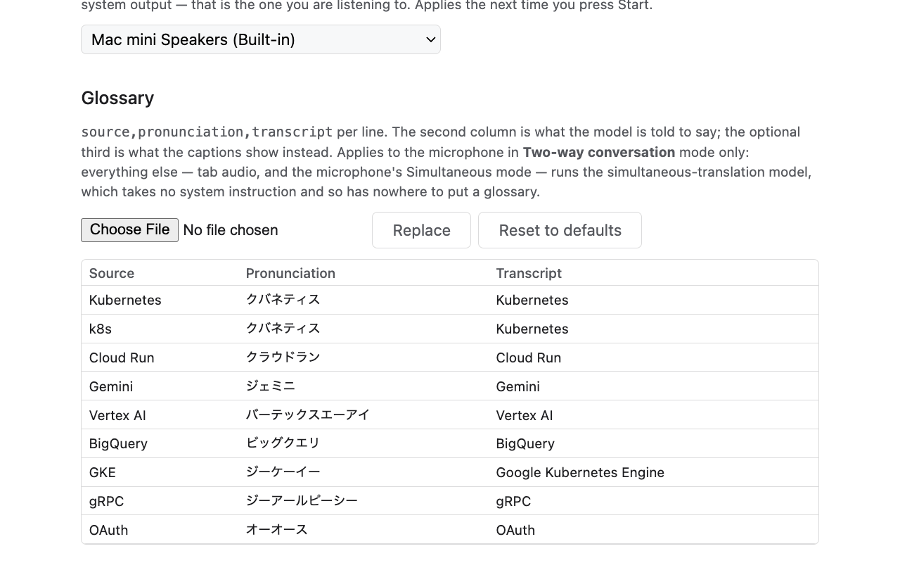

**English** · [日本語](ja/)

<h1 style="display:flex;align-items:center;gap:.7rem;margin:0 0 .4rem">
  
  <span>Interpretab</span>
</h1>

**A Chrome extension that translates what your browser plays, and what you say, into 70+
languages in real time — spoken out loud and subtitled on the page.**

## What you can use it for

<div style="margin:1rem 0 1.5rem">
  <p style="margin:0 0 .6rem"><b>Translating browser audio</b></p>
  <div style="display:flex;flex-wrap:wrap;gap:1rem 1.5rem;margin:0 0 1.25rem">
    <div style="flex:1 1 17rem;display:flex;gap:.9rem;align-items:center">
      
      <span>Watch a video, a live stream or a podcast playing in your browser in the language
      you prefer.</span>
    </div>
    <div style="flex:1 1 17rem;display:flex;gap:.9rem;align-items:center">
      
      <span>Follow an online meeting with everything the other side says translated into your
      language.</span>
    </div>
  </div>
  <p style="margin:0 0 .6rem"><b>Translating microphone audio</b></p>
  <div style="display:flex;flex-wrap:wrap;gap:1rem 1.5rem">
    <div style="flex:1 1 17rem;display:flex;gap:.9rem;align-items:center">
      
      <span>Give a presentation or a live stream with your own voice subtitled on screen in
      another language.</span>
    </div>
    <div style="flex:1 1 17rem;display:flex;gap:.9rem;align-items:center">
      
      <span>Meet in a room, or talk with friends, with everyone interpreted into the language
      you pick.</span>
    </div>
  </div>
</div>

[](store/hero-tab-ja-en.png)

<p><a href="https://www.youtube.com/watch?v=jiY8WJgeKCA">▶ Watch it run (2:45)</a></p>

## How Interpretab works, and privacy

Interpretab translates through Google's
[Gemini Live API](https://ai.google.dev/gemini-api/docs/live). Your audio, your subtitles and your
key travel encrypted between your browser and Google, and reach nowhere else. There is no
analytics or data-collection server either. Note that, being a Gemini Live API model, it can
translate inaccurately, and it can produce speech that is not a translation at all.

- [Privacy policy](PRIVACY.html)

## Free to try, about $2 an hour to keep running

Interpretab is an open-source tool. The Gemini Live API behind the translation is what costs
money, and its free tier is enough to try it — after that, **the Gemini Live API usage is billed to
your own Google account**.

Here are the Gemini Live API rates
[Google publishes](https://ai.google.dev/gemini-api/docs/pricing) as of August 2026:

| What is running | Audio in | Audio out | **Per hour** |
|---|---|---|---|
| Tab audio, or the microphone in Simultaneous mode | $0.0053/min | $0.0315/min | **≈ $2.20** |
| The microphone in Two-way conversation mode | $0.005/min | $0.018/min | **≈ $1.40** |

Those are hours of *continuous* audio, so less talking costs less. Turning tab audio and the
microphone on together runs two sessions, so the price is the sum of the two rows.

## Install

Interpretab installs like this:

1. Download or clone [the repository](https://github.com/kazunori279/interpretab).
2. Open `chrome://extensions`, turn on **Developer mode**, click **Load unpacked**, pick that
   folder.
3. Get a free Gemini API key at
   [aistudio.google.com/apikey](https://aistudio.google.com/apikey) and paste it into the
   extension's **Options** page.
4. Open the page you want translated and **click the Interpretab toolbar icon on that tab**. That
   click is how you give permission to listen to the tab — skip it and you get an error.
5. Pick your language in the side panel and press **Start**.

Chrome 116 or newer. Closing the side panel does not stop the translation — the **Stop** button is
always one click on the toolbar icon away, from any tab.

## Choosing what to translate

Interpretab has two directions, tab audio and microphone. Either on its own, or both at once.

[](store/screenshot-4-panel.png)

**Tab audio** translates whatever the current tab is playing into the language you pick, from a
choice of 78.

**Microphone** translates what your computer's microphone hears. It has two modes:

- **Simultaneous** translates speech into one language without waiting for the speaker to finish a
  sentence.
- **Two-way conversation** is for two people talking in two languages. Name both languages, put the
  laptop on the desk between you, and it waits for each speaker to finish and routes them to the
  other language — set English and Japanese, and it hears English, it says Japanese; it hears
  Japanese, it says English. No switching. 97 languages, and it is the only mode a
  [glossary](#glossary) reaches.

Turning tab audio and the microphone on together bills them as two separate sessions, so the cost
is the sum of the two.

### Subtitles and the spoken translation

Subtitles appear bottom-centre of the page, three lines at a time, and they follow the video into
fullscreen. When both tab audio and the microphone are on, the microphone's line is marked with a
blue edge. **Options → Subtitle size** sets how tall they are, 16–64 px, live while you watch.

The translated voice comes out of your computer's audio output, and a mute button silences it at
any time. With tab audio, the tab's own sound **keeps playing underneath at a lower volume** while
the translation speaks, so a film's music and effects are still there to hear.

**Options → Audio input/output** picks which device the microphone is heard on, and which one the
translation is spoken out of.

### Using it in online meetings

**Hearing the other side is what this tool does out of the box.** Open the meeting in a tab, turn
tab audio on, pick your language and press Start. What they say arrives in your language, spoken
and subtitled.

For them to hear your voice translated, they need Interpretab installed in their browser too. And
because this is a Chrome extension, it only works with the browser versions of these services —
desktop apps and native clients are out of reach.

### The models behind the translation, and its quality

Tab audio and the microphone's Simultaneous mode run on the Gemini Live API's
[Live Translate](https://ai.google.dev/gemini-api/docs/models/gemini-3.5-live-translate-preview)
model. The microphone's Two-way conversation mode runs on the
[Gemini Live model](https://aistudio.google.com/docs/live-api), which cannot translate
simultaneously — it waits for the speaker to finish — but translates better than Live Translate
does, and is the only one that takes the glossary below.

Either way, the model can misfire, and subtitles can come out with the wrong content, or in the
wrong language.

### Glossary

Product names, people's names and jargon are what a general model most often gets wrong, in both
pronunciation and spelling. The **microphone's Two-way conversation mode** takes a glossary to cut
those mistakes down; no other mode does. The model can still misfire here, and a registered
pronunciation or spelling may not come through.

**Options → Glossary** takes a CSV like this:

```
source,pronunciation,transcript
Kubernetes,クバネティス,Kubernetes
Cloud Run,クラウドラン,Cloud Run
```

The first column is the term to match, the second is the *pronunciation* the model is told to use,
and the third is what you want the **subtitles to show**.

[](store/screenshot-3-glossary.png)

### Things to know

- **Use earphones or headphones for the microphone's Simultaneous mode.** That mode speaks over
  you, so the microphone picks its own translated voice back up — an echo loop — and translation
  quality drops badly.
- **If you want external speakers with the microphone, use a microphone with a mute button.**
  Speakers feed the translated voice back into the microphone — an echo loop — and the translation
  stops working properly. Unmute only while you are speaking.
- **Tab audio and the microphone at the same time means two sessions**, and a cost that goes up to
  match.
- **Interpretab runs on one tab at a time.** While it is running, the side panel on any other tab
  names the tab it is running on and offers only **Stop**. Stop it there and Start comes back.
- **Chrome does not let extensions draw on its own pages or on PDFs**, so subtitles cannot appear
  there. The spoken translation and the side-panel transcript still work.

## More about using the Gemini Live API

The side panel keeps a meter of what the run has used so far, and starts again at zero each time
you press Start. What it shows depends on **Options → Gemini API plan**: pick whether the key you
are using is on the free tier or on Tier 1.

- **Free** (the default): *12 min so far, 18 min of Gemini audio. The free tier is charged nothing
  for it.* No price, because there is no price. The audio time is the number worth watching: the
  free tier is limited by rate rather than by money, so that is what its limits are spent on.
- **Paid**: *12 min so far, ~$0.31 of Gemini usage this run — an estimate, not your actual bill.*

Set the plan when you paste the key — it is the project you made the key in, and a project is on
the paid tier once it has a billing account linked. **Your Google account is the only place your
actual bill exists.**

### Choosing between the free tier and a paid one

What a Gemini API key costs, how hard it is rate-limited, and what Google does with what you send
through it all depend on the project's **usage tier**. The qualifications
[Google publishes](https://ai.google.dev/gemini-api/docs/rate-limits) are:

| Tier | How you qualify | Cost and limits | What Google does with your data | Where it fits Interpretab |
|---|---|---|---|---|
| **Free** | No billing account needed | Free of charge, but long or heavy use runs into the rate limits and errors out | **Used to improve Google's products, and subject to human review** | Trying it out |
| **Tier 1** | Link an active billing account | Pay as you go, up to $10 per 10 minutes and $250 a month | Not used to improve products; logged briefly for abuse detection only | **Where to be if you use it regularly.** Enough for almost any use |

Start on the free tier, and link a billing account to reach Tier 1 once you keep using it. On
Tier 1 nothing you send is used to improve Google's products, and the ceilings are roomy for a tool
like this one: about 25 Interpretab sessions running at the same time, and around 110 hours a
month. Google documents [how to set the billing
up](https://ai.google.dev/gemini-api/docs/billing#setup-billing).

### Sharing one Gemini API key between machines and people

Interpretab keeps the key on the machine, in `chrome.storage.local`. Chrome's profile sync does not
carry it, so using Interpretab on several computers means pasting the key into each of them.
**Using one key on your own several machines is fine.**

**Handing the key to someone else is not**, under Google's
[API Terms of Service](https://developers.google.com/terms).

### Things to know about your Gemini API key

- **Rate limits are per project, not per key.**
  [Google's documentation](https://ai.google.dev/gemini-api/docs/rate-limits) says so in as many
  words. Tier 1's $10 per 10 minutes is about 25 Interpretab sessions at once, and anything past
  that errors out.
- **A key is a password.** If it gets out,
  [Google's guidance](https://ai.google.dev/gemini-api/docs/api-key) applies: "others can consume
  your project's quota, incur unexpected billing charges, and access private resources." When you
  part with a machine, or think a key may have leaked, delete the old key in
  [AI Studio](https://aistudio.google.com/apikey) and make a new one.
- **For a team, one key per person.** Give each member their own project under the same Google
  Cloud billing account and the payment stays in one place while the keys and the rate limits do
  not.
- **For users in the EEA, Switzerland or the UK**, the
  [Gemini API Additional Terms](https://ai.google.dev/gemini-api/terms) require a paid tier.
- **If it will not connect to the Gemini Live API**, either the key is wrong or the quota has run
  out — Interpretab cannot tell the two apart. Check the limits in
  [AI Studio](https://aistudio.google.com/apikey) and wait for them to reset, or set up billing and
  move to Tier 1.

## Open source

Apache 2.0. Source, the engineering notes behind all of the above, and the issue tracker:

- [github.com/kazunori279/interpretab](https://github.com/kazunori279/interpretab)
- [Report a problem or ask for a feature](https://github.com/kazunori279/interpretab/issues)
