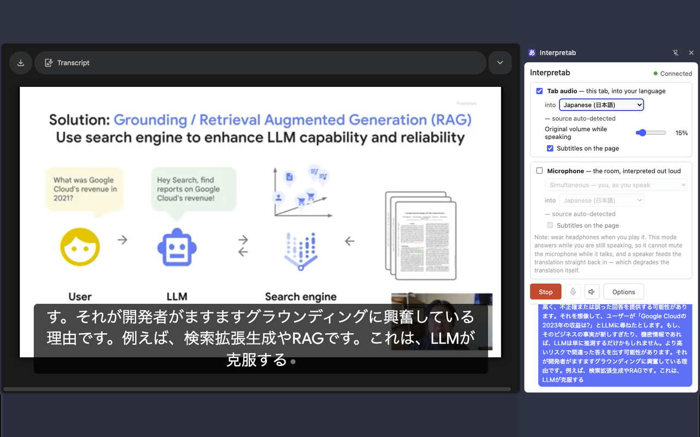

[English](../) · **日本語**

# Interpretab

**タブが再生している音声を、あなたの言語で読み上げ、そのままページにキャプションとして出します。**
逆方向もできます。あなたのマイクを、相手の言語へ。

動画、ウェビナー、カンファレンスの配信、通話の相手側。Interpretab はブラウザが鳴らしている音声を
通訳し、その訳を元音声にかぶせて再生しながら、同時にページの下部にキャプション表示します。

[](../store/screenshot-1-subtitles.png)

<p><a href="https://www.youtube.com/watch?v=jiY8WJgeKCA">▶ 動作の様子 (2:45)</a></p>

## インストール

Interpretab は Chrome ウェブストアに申請済みで、現在**審査待ち**です。公開されれば
[chromewebstore.google.com/detail/johnocemcoemdhiogfgmphjmlghgdnbm](https://chromewebstore.google.com/detail/johnocemcoemdhiogfgmphjmlghgdnbm)
に置かれます。

それまでは自分で読み込んでください。中身は同じものです。

1. [リポジトリ](https://github.com/kazunori279/interpretab)をダウンロード、または clone する。
2. `chrome://extensions` を開き、**デベロッパーモード**を ON にして、**パッケージ化されていない拡張機能を
   読み込む**からそのフォルダを選ぶ。
3. [aistudio.google.com/apikey](https://aistudio.google.com/apikey) で無料の Gemini API キーを取得し、
   拡張機能の**オプション**ページに貼り付ける。
4. 翻訳したいページを開き、**そのタブで Interpretab のツールバーアイコンをクリックする**。この
   クリックが「このタブの音声を聞いていいですよ」という許可になります。押さずに始めると、Start が
   エラーになります。
5. サイドパネルで言語を選び、**Start** を押す。

Chrome 116 以降が必要です。サイドパネルを閉じても翻訳は止まりません。**Stop** はどのタブからでも
ツールバーアイコンをクリックすれば届きます。

## API キーと費用について

Interpretab に**サーバはありません**。ブラウザから Google の
[Gemini Live API](https://ai.google.dev/gemini-api/docs/live) へ、あなたが用意したキー（Gemini API Key）で直接つなぎます。
音声もキーも、あなたのブラウザと Google のあいだだけをやりとりします。あいだに立つサービスがないので、
どこかに預けたデータが漏れる、という心配がありません。

**使用量はあなた自身の Google アカウントに、Google の料金で請求されます**。Interpretab が使う 2 つのモデルにはどちらも無料枠があり、試すだけなら十分です。キーは端末内に安全に保存されます。

### だいたいの費用

Live API は音声を入出力それぞれ分単位で課金します。2026 年 8 月時点で
[Google が公開している](https://ai.google.dev/gemini-api/docs/pricing)有料レートは次のとおりです。

| 動かしているもの | 音声入力 | 音声出力 | **1 時間あたり** |
|---|---|---|---|
| タブ音声、またはマイクの Simultaneous モード | $0.0053/min | $0.0315/min | **約 $2.20** |
| マイクの Two-way conversation モード | $0.005/min | $0.018/min | **約 $1.40** |

タブ音声とマイクを両方 ON にすると、それぞれ別のセッションとして課金されるので、料金は上の 2 行の合計になります。Two-way conversation はモードの名前に「two-way」と付いていますがセッションは 1 つなので、これには当たりません。

これは音声が**途切れず続いた場合**の 1 時間で、いちばん高く見積もった数字です。費用のほとんどは出力側
で、出力は誰かが喋っているあいだしか流れません。録画された講演はほぼ連続ですが、自分は聞くだけの
ミーティングはそうなりません。

## モードを選ぶ

Interpretab では、タブ音声モードとマイクモードの 2 つをサポートしています。片方だけでも両方同時でも動きます。

[](../store/screenshot-4-panel.png)

**タブ音声**は、いまそのタブが再生しているものを通訳します。指定するのは訳先の言語だけです。元の言語は
自動判定されます。タブは再生されているものを再生するだけですし、話者が途中で変わる動画のたびに設定を
変えさせるのは筋が悪いからです。訳先は 78 言語。

**マイク**はあなた自身を通訳します。こちらには 2 つのモードがあります。

- **Simultaneous**（同時翻訳）は 1 つの言語へ訳し、文が終わるのを待ちません。だから simultaneous
  です。元の言語は自動判定、訳先は同じ 78 言語。あなたに覆いかぶせて喋るので、ヘッドフォンを使って
  ください。
- **Two-way conversation** （二者間翻訳）は、1 本のマイクを 2 人で共有するためのモードです。両方の言語を指定して
  ノート PC を机の上に置けば、聞こえた発話をもう一方の言語へ振り分けます。例えば英語と日本語を設定すれば、英語が聞こえれば日本語で
  喋り、日本語が聞こえれば英語で喋る。押すボタンも切り替え操作もありません。97 言語・30 音声で、
  [用語集](#glossary)が効くのはこのモードだけです。

## キャプション機能

キャプションはページの下部中央に 3 行分が表示され、動画をフルスクリーンにしても付いていきます。両モードが ON のときは、マイク側の行に
青い縁が付きます。**オプション → Subtitle size** で 16〜64 px の範囲を、見ながら変更できます。

タブ本来の音声は訳の裏に消えるわけではなく、**小さな音量で同時に再生**されます。訳の音声が鳴っているあいだだけ元音声
が 15%（スライダで変更可）まで下がり、止まればすぐ戻ります。常時ではなく発話に反応する方式なので、
例えば映画の音楽や効果音なども聞くことができます。

Start の隣にはマイク用と翻訳音声用の 2 つのミュートボタンがあります。どちらもキャプション表示には影響しません。

なお翻訳モデルの誤動作により、誤った内容や言語のキャプションが表示される場合もあります。

## 用語登録機能
{: #glossary }

製品名・人名・専門用語などの読みや表記を間違えずに翻訳する機能です。**オプション → Glossary** で、以下のような CSV ファイルをアップロードして登録できます。

```
source,pronunciation,transcript
Kubernetes,クバネティス,Kubernetes
Cloud Run,クラウドラン,Cloud Run
```

2 列目はモデルに*読み*を伝える内容、3 列目は**キャプションに表記**したい内容です。

[](../store/screenshot-3-glossary.png)

用語登録機能は**マイクモードの Two-way conversation だけ**で動作します。また翻訳モデルの誤動作により、登録した読みと表記が反映されない場合もあります。

## Meet・Zoom・Teams で使う

**相手側の音声を聞く際には、このツールによる翻訳が使えます。** ミーティングをタブで開き、タブ音声を ON にして言語を
選び、Start を押すだけ。相手の発言が全部あなたの言語で、音声とキャプションの両方で届きます。

相手側にも自分の声の翻訳を聞いてもらうには、相手側のブラウザにも Interpretab をインストールしてもらう必要があります。なお、このツールは Chrome ブラウザのみ対応しているため、デスクトップアプリやネイティブクライアントには対応していません。

## 注意点

- **マイクモードでは、イヤホンやヘッドホンを使ってください。** スピーカーで鳴らすと、翻訳された音声を
  マイクがまた拾ってしまい（エコーループ）、翻訳品質が大きく下がります。どうしてもスピーカーを使いたい
  場合は、ミュートボタン付きのマイクにして、自分が話すときだけマイクを開いてください。
- **タブ音声とマイクを同時に使うと、課金されるセッションも 2 つ**になります。Two-way conversation は 1 セッションなので、こちらは対象外です。
- **Chrome は自身のページ・ウェブストア・PDF への描画を拡張機能に許していない**ので、それらにはキャプションが
  出ません。音声とサイドパネルの文字起こしは動きます。

## 誤動作について

この翻訳ツールはGoogleが開発した AI モデルを使用しており、不正確な翻訳や、翻訳以外の会話を生成することがあります。

## プライバシー

あなたの音声やキャプション、キー等は、ブラウザから Google の Gemini API へ行き、それ以外のどこへも届きません。またデータ収集用のサーバーに利用状況が送られることもありません。

全文: [プライバシーポリシー](../PRIVACY.html)（英語）。

## オープンソース

Apache 2.0。ソース、上記すべての背景にある技術メモ、そして不具合の報告先はこちらです。

- [github.com/kazunori279/interpretab](https://github.com/kazunori279/interpretab)
- [不具合の報告・機能の要望](https://github.com/kazunori279/interpretab/issues)
