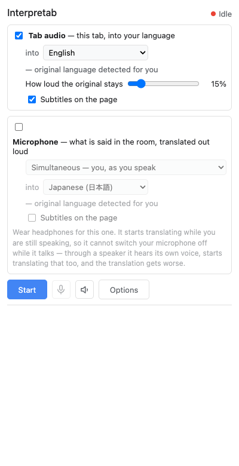
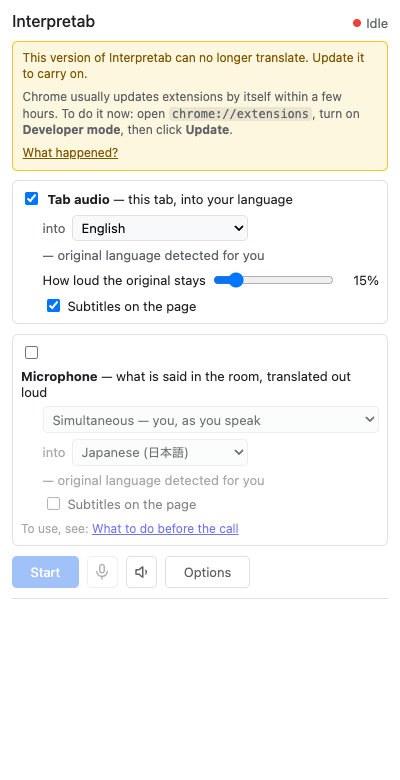
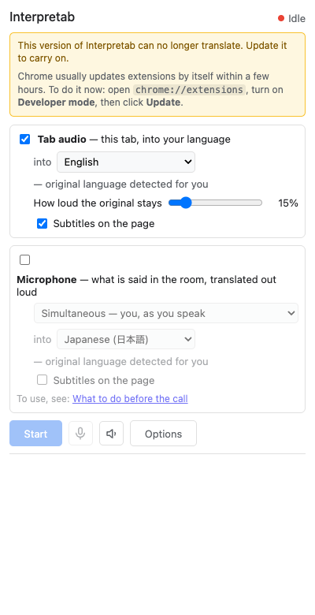
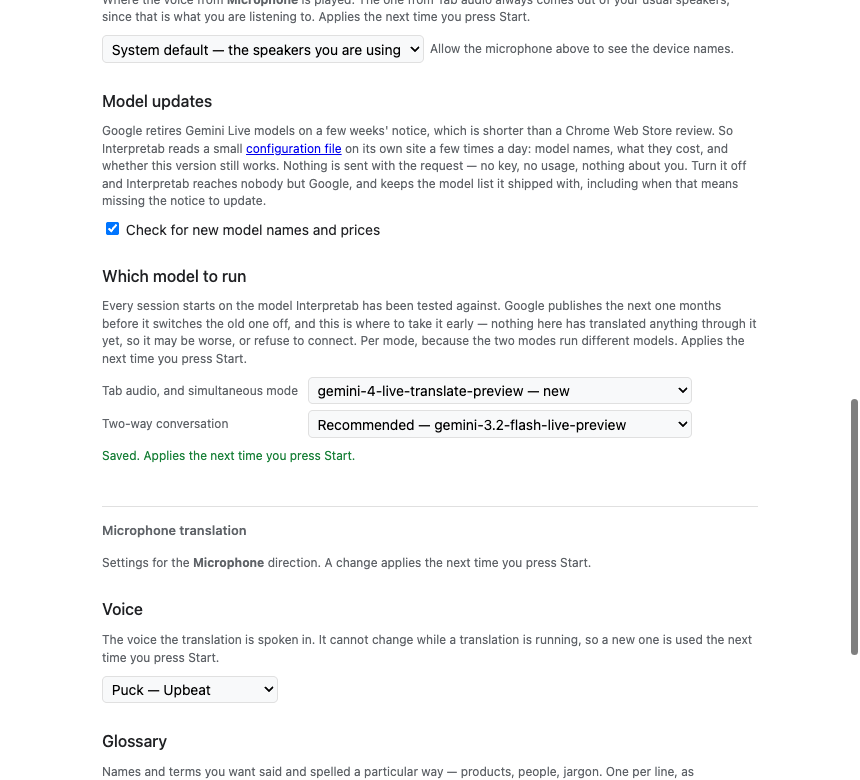
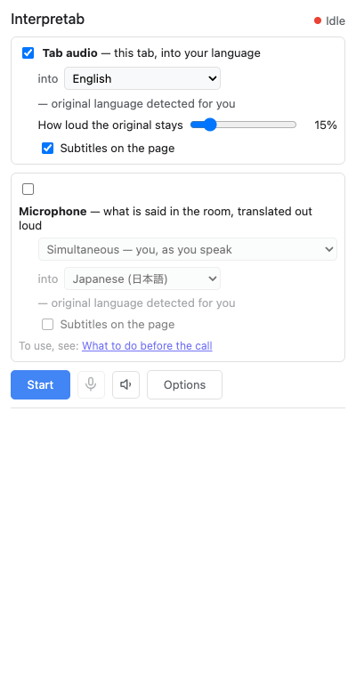

# The update notice, walked

Interpretab 1.0.4 · Chrome/151.0.7922.174 · headless · UI language en-US (`_locales/en`) · 2026-08-24T22:13:40.671Z

**29 checks over 5 steps, all passing.**

Written by `node tests/config-ui.mjs`, which installs the unpacked extension into a throwaway Chrome profile over the DevTools Protocol and drives the three states of the update notice. No key, no quota and no network: every state is seeded into the cache the way a successful fetch would have left it, inside the TTL, so nothing is downloaded.

| # | Step | Checks |
| --- | --- | --- |
| 1 | A file that blocks nothing is not visible at all | ✅ 3 |
| 2 | A block reaches a panel that has already finished rendering | ✅ 7 |
| 3 | The link is the file's to offer, and only within this project | ✅ 6 |
| 4 | The successor is offered months before it is compulsory | ✅ 4 |
| 5 | Turning the switch off stops the request and forgets the answer | ✅ 9 |

## 1. A file that blocks nothing is not visible at all

The ordinary case, and the one that has to stay silent: the extension reads this file a few times a day for the rest of its life, and the user should never learn that it exists.

| | Check | Expected | Actual |
| --- | --- | --- | --- |
| ✅ | the notice stays hidden | `true` | `true` |
| ✅ | Start is available | `false` | `false` |
| ✅ | and the worker agrees | `{"ok":true,"blocked":false,"learnMoreUrl":""}` | `{"ok":true,"blocked":false,"learnMoreUrl":""}` |

## 2. A block reaches a panel that has already finished rendering

The verdict is fetched after `init()` returns, because holding the panel's first paint on a network call would make every ordinary open slower for a notice almost nobody will ever see. So the banner has to arrive late and re-run `render()` behind itself.

| | Check | Expected | Actual |
| --- | --- | --- | --- |
| ✅ | the banner appears without a second reload | `true` | `true` |
| ✅ | the first line says the build cannot translate | `This version of Interpretab can no longer translate. Update it to carry on.` | `This version of Interpretab can no longer translate. Update it to carry on.` |
| ✅ | the second says how to update | `Chrome usually updates extensions by itself within a few hours. To do it now: open chrome://extensions, turn on Developer mode, then click Update.` | `Chrome usually updates extensions by itself within a few hours. To do it now: open chrome://extensions, turn on Developer mode, then click Update.` |
| ✅ | the address is set in code type | `["chrome://extensions"]` | `["chrome://extensions"]` |
| ✅ | and Chrome's own two labels are in bold | `2` | `2` |
| ✅ | Start is refused | `true` | `true` |
| ✅ | the worker refuses it too, which is what a Start would hit | `{"ok":true,"blocked":true,"learnMoreUrl":"https://kazunori279.github.io/interpretab/"}` | `{"ok":true,"blocked":true,"learnMoreUrl":"https://kazunori279.github.io/interpretab/"}` |

## 3. The link is the file's to offer, and only within this project

`learnMoreUrl` exists so the notice can point at a page written after the build shipped. `parseConfig` drops any destination outside this project's own site, and the panel shows nothing at all rather than guessing when it is left with none.

| | Check | Expected | Actual |
| --- | --- | --- | --- |
| ✅ | a link the file gave is shown | `false` | `false` |
| ✅ | with its own wording, not the file's | `What happened?` | `What happened?` |
| ✅ | pointing where the file said | `https://kazunori279.github.io/interpretab/` | `https://kazunori279.github.io/interpretab/` |
| ✅ | and it opens outside the panel | `_blank` | `_blank` |
| ✅ | no destination, no link | `true` | `true` |
| ✅ | and the notice itself is unaffected | `This version of Interpretab can no longer translate. Update it to carry on.` | `This version of Interpretab can no longer translate. Update it to carry on.` |

## 4. The successor is offered months before it is compulsory

A new Live model appears long before the one in use is switched off, and the recommended order deliberately does not move on the day it appears — nothing here has run a translation through it yet. So the file's other names are a menu in Options, per mode, and with no telemetry the people who take it early are the only compatibility signal this project gets.

| | Check | Expected | Actual |
| --- | --- | --- | --- |
| ✅ | the file's names are on the menu, the recommendation first | `["Recommended — gemini-3.5-live-translate-preview","gemini-3.5-live-translate-preview — until 2026-12-01","gemini-4-live-translate-preview — new"]` | `["Recommended — gemini-3.5-live-translate-preview","gemini-3.5-live-translate-preview — until 2026-12-01","gemini-4-live-translate-preview — new"]` |
| ✅ | and nothing is chosen until somebody chooses it | `` | `` |
| ✅ | the other mode has its own list, and its own build fallback | `["Recommended — gemini-3.2-flash-live-preview","gemini-3.2-flash-live-preview","gemini-3.1-flash-live-preview"]` | `["Recommended — gemini-3.2-flash-live-preview","gemini-3.2-flash-live-preview","gemini-3.1-flash-live-preview"]` |
| ✅ | a choice is saved, and only for the mode it was made in | `gemini-4-live-translate-preview / ` | `gemini-4-live-translate-preview / ` |

## 5. Turning the switch off stops the request and forgets the answer

Both halves matter. Leaving a cached block behind would mean a user who opted out of the file stayed blocked by the last thing it said, with nothing left that could ever lift it — the one way this feature could strand somebody for good.

| | Check | Expected | Actual |
| --- | --- | --- | --- |
| ✅ | there is something cached to forget | `1` | `1` |
| ✅ | the switch is on to begin with | `true` | `true` |
| ✅ | and off once clicked | `true` | `true` |
| ✅ | the model menu collapses to the name this build shipped with | `["Recommended — gemini-3.5-live-translate-preview","gemini-3.5-live-translate-preview"]` | `["Recommended — gemini-3.5-live-translate-preview","gemini-3.5-live-translate-preview"]` |
| ✅ | and says what happened to the choice | `gemini-4-live-translate-preview is not on the list any more, so that mode runs the recommended model.` | `gemini-4-live-translate-preview is not on the list any more, so that mode runs the recommended model.` |
| ✅ | the worker now has no opinion | `{"ok":true,"blocked":false,"learnMoreUrl":null}` | `{"ok":true,"blocked":false,"learnMoreUrl":null}` |
| ✅ | the cached copy is gone | `0` | `0` |
| ✅ | so the notice is not shown | `true` | `true` |
| ✅ | and Start works again | `false` | `false` |

<!-- extension id in this run: nijemdcimhcnenibolgeoejmjdfooado -->
