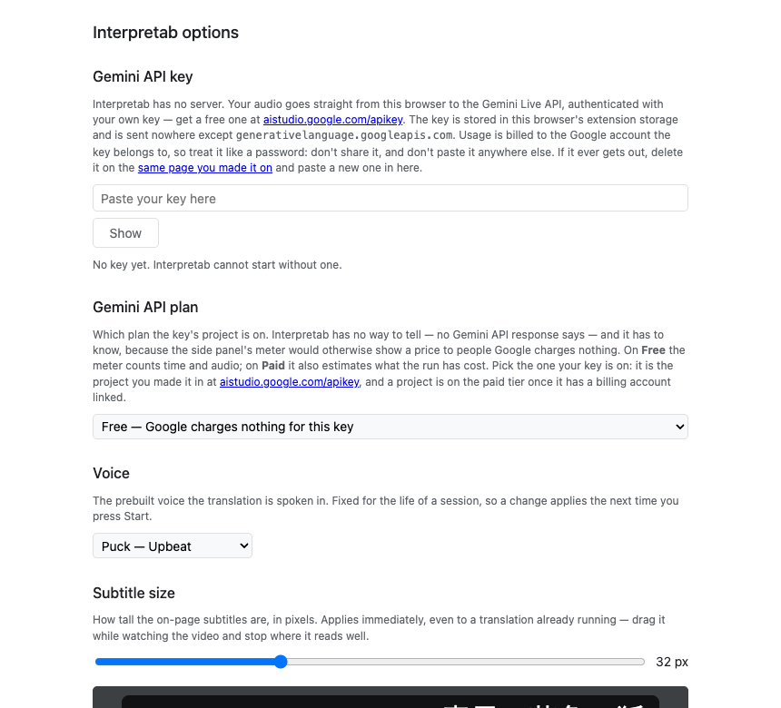
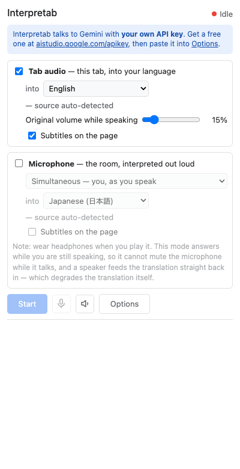
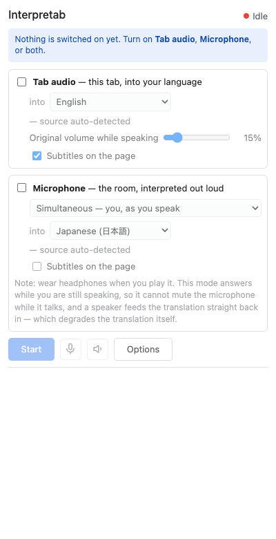
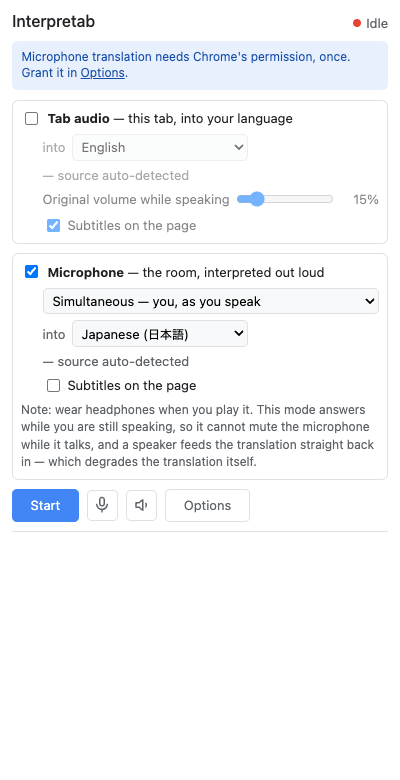
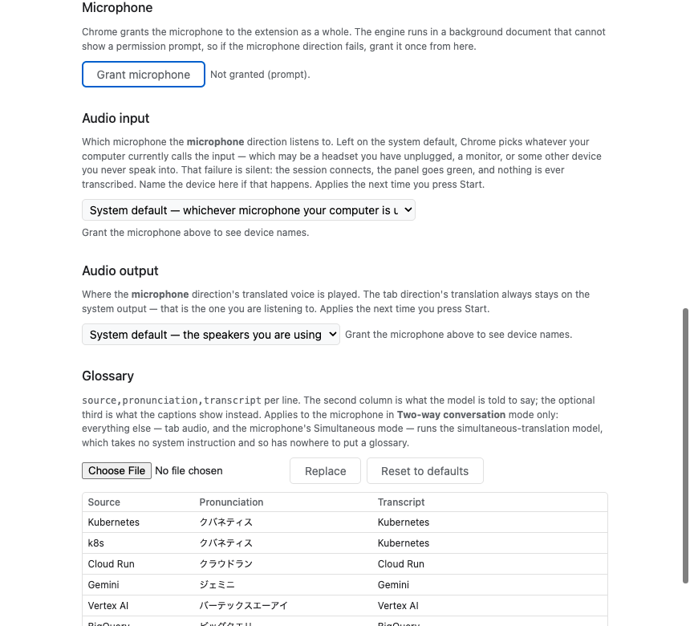
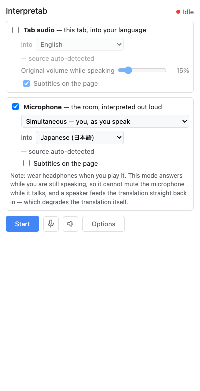

# Onboarding walkthrough

Interpretab 1.0.0 · Chrome/151.0.7922.169 · headless · UI language en-US (`_locales/en`) · 2026-08-19T20:51:55.148Z

**27 checks over 8 steps, all passing.**

Written by `node tests/onboarding.mjs`, which installs the unpacked extension into a throwaway Chrome profile over the DevTools Protocol and walks a first run. The extension id below is that profile's, not the store's. No key and no quota: the key it types is a placeholder and nothing here reaches the Live API.

| # | Step | Checks |
| --- | --- | --- |
| 1 | Installing the extension opens Options | ✅ 2 |
| 2 | The panel asks for the key first | ✅ 3 |
| 3 | With a key and nothing switched on, it asks for a direction | ✅ 4 |
| 4 | Switching the microphone on asks for Chrome's permission | ✅ 4 |
| 5 | The link lands on the microphone section, not the top of the page | ✅ 4 |
| 6 | It lands there too when Options is already open | ✅ 5 |
| 7 | Granting the permission clears the banner where the user is not looking | ✅ 3 |
| 8 | Taking it away brings the banner back | ✅ 2 |

Not covered here: the real side panel, which is browser UI and is walked as a tab of the same document; Chrome's permission prompt, which the protocol cannot click and whose two states are therefore set directly; and any microphone, since a headless browser has none.

## 1. Installing the extension opens Options

`chrome.runtime.onInstalled` with reason `install` calls `openOptionsPage()`, so the key has somewhere to be pasted before anything else is tried.

| | Check | Expected | Actual |
| --- | --- | --- | --- |
| ✅ | an Options tab opens by itself | `true` | `true` |
| ✅ | it belongs to this extension | `chrome-extension://nijemdcimhcnenibolgeoejmjdfooado/options.html` | `chrome-extension://nijemdcimhcnenibolgeoejmjdfooado/options.html` |

## 2. The panel asks for the key first

With nothing configured, the panel names the one thing that has to happen before any other step matters, and links to both halves of it.

| | Check | Expected | Actual |
| --- | --- | --- | --- |
| ✅ | the banner is the key step | `Interpretab talks to Gemini with your own API key. Get a free one at aistudio.google.com/apikey, then paste it into Options.` | `Interpretab talks to Gemini with your own API key. Get a free one at aistudio.google.com/apikey, then paste it into Options.` |
| ✅ | it links to AI Studio and to Options | `[{"href":"https://aistudio.google.com/apikey","action":""},{"href":"#","action":"options"}]` | `[{"href":"https://aistudio.google.com/apikey","action":""},{"href":"#","action":"options"}]` |
| ✅ | Start is disabled | `true` | `true` |

## 3. With a key and nothing switched on, it asks for a direction

The second precondition. Start is disabled here for the same reason, and the sentence says which two switches undo it.

| | Check | Expected | Actual |
| --- | --- | --- | --- |
| ✅ | the banner is the direction step | `Nothing is switched on yet. Turn on Tab audio, Microphone, or both.` | `Nothing is switched on yet. Turn on Tab audio, Microphone, or both.` |
| ✅ | it names both switches in bold | `2` | `2` |
| ✅ | it has no links | `[]` | `[]` |
| ✅ | Start is disabled | `true` | `true` |

## 4. Switching the microphone on asks for Chrome's permission

The third precondition, and the only one the panel cannot resolve itself: Chrome will not raise its prompt in a side panel, so the banner links to the Options page instead.

| | Check | Expected | Actual |
| --- | --- | --- | --- |
| ✅ | Chrome has not granted the microphone | `prompt` | `prompt` |
| ✅ | the banner is the microphone step | `Microphone translation needs Chrome's permission, once. Grant it in Options.` | `Microphone translation needs Chrome's permission, once. Grant it in Options.` |
| ✅ | its link goes to the Options microphone section | `[{"href":"#","action":"optionsMic"}]` | `[{"href":"#","action":"optionsMic"}]` |
| ✅ | Start is not disabled by it | `false` | `false` |

## 5. The link lands on the microphone section, not the top of the page

`openOptionsPage()` takes no fragment, so the panel leaves the destination in session storage and the Options page reads it. Eight sections down, the difference is the whole point.

| | Check | Expected | Actual |
| --- | --- | --- | --- |
| ✅ | an Options page opens | `true` | `true` |
| ✅ | the Grant button has the focus | `true` | `true` |
| ✅ | the Microphone heading is at the top of the viewport | `true` | `true` |
| ✅ | the request is consumed, not left for the next visit | `{}` | `{}` |

## 6. It lands there too when Options is already open

`openOptionsPage()` focuses an existing tab rather than loading one, and after the install-time open that tab is exactly what is already there — so the page has to take the request as a storage change as well as on load.

| | Check | Expected | Actual |
| --- | --- | --- | --- |
| ✅ | the page starts back at the top | `0` | `0` |
| ✅ | the Grant button takes the focus again | `true` | `true` |
| ✅ | the Microphone heading is at the top of the viewport | `true` | `true` |
| ✅ | no second Options tab was opened | `1` | `1` |
| ✅ | the request is consumed here too | `{}` | `{}` |

## 7. Granting the permission clears the banner where the user is not looking

The grant happens on the Options page and the banner is in the panel. The panel subscribes to the permission rather than re-reading it on open, so this is the step that would silently rot.

| | Check | Expected | Actual |
| --- | --- | --- | --- |
| ✅ | the banner goes away without a reload | `true` | `true` |
| ✅ | the panel sees the grant | `granted` | `granted` |
| ✅ | Start is available | `false` | `false` |

## 8. Taking it away brings the banner back

The same subscription, in the direction a user reaches through Chrome's site settings. Without this the panel would tell someone who has revoked the permission that they are ready to start.

| | Check | Expected | Actual |
| --- | --- | --- | --- |
| ✅ | the banner returns without a reload | `true` | `true` |
| ✅ | and it is the microphone step again | `Microphone translation needs Chrome's permission, once. Grant it in Options.` | `Microphone translation needs Chrome's permission, once. Grant it in Options.` |

<!-- extension id in this run: nijemdcimhcnenibolgeoejmjdfooado -->
